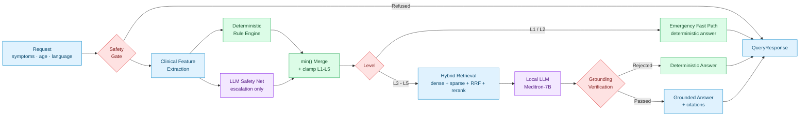

# MediMama 🍼

**Safety-oriented pediatric triage with grounded RAG.**

A multilingual clinical decision-support prototype built around one principle:

> A probabilistic model may **escalate** urgency, but it must **never** make a deterministic triage decision *less* urgent.

`FastAPI` · `Qdrant` · `Meditron-7B` · `Hybrid RAG` · `Docker` · `English / فارسی / العربية`

> [!WARNING]
> **Research prototype — not a medical device.** Not clinically validated. Must not be used for diagnosis or as a substitute for professional medical care. In an emergency, contact local emergency services.

---

## Demo

[](https://www.youtube.com/watch?v=VIDEO_ID)

---

## How It Works



🟢 deterministic · 🟣 probabilistic · 🔴 safety gate · 🔵 I/O

📄 **[Full architecture →](docs/ARCHITECTURE.md)**

---

## Evaluation

Measured with [**`rag-eval`**](https://github.com/Tshoopa/rag-eval), a standalone evaluation framework built for this project.

| Metric | Result |
| :--- | :---: |
| Evaluation cases | **92** |
| Exact-match accuracy | **69.6%** |
| Clinical safety rate (not under-triaged) | **82.6%** |
| Critical-case recall (L1) | **95%** |
| Adversarial downgrade attempts blocked | ✅ |

11 of the 16 under-triage results were `L4 → L5` disagreements on benign presentations such as warts and cradle cap, revealing label ambiguity in the evaluation set rather than clinical risk.

📊 **[Confusion matrix, under-triage analysis, and interactive report →](docs/EVALUATION.md)**

> These are engineering test-set results, not clinical validation.

---

## Design Decisions

**Deterministic first.** Urgency is assigned by testable rules. The LLM merge is `min(deterministic, llm)` — since `L1` is most urgent, taking the minimum makes downgrading structurally impossible.

**Errors escalate, never de-escalate.** If the triage engine raises, the request falls back to `L3`, not `L5`. A defensive default that reduces urgency is not a defensive default.

**Emergency cases skip the model.** `L1` and `L2` bypass retrieval and generation entirely — the most time-critical responses are fully deterministic and reviewable.

**Generated output is guilty until proven grounded.** Answers pass prompt-leak detection, boilerplate truncation, deduplication, and grounding verification. Any rejection falls back to a deterministic answer.

**Refusals are not triaged.** A declined request returns `emergency_level: null`, never `L5`. Defaulting to `L5` would present it as clinically low-urgency.

**Nothing takes down `/ask`.** Qdrant, the local LLM, translation, and audit logging each degrade independently instead of failing the request.

🛡️ **[Full safety design →](docs/ARCHITECTURE.md#safety-design)**

---

## Quick Start

```bash
git clone https://github.com/Tshoopa/medimama.git
cd medimama

mkdir -p models && wget -O models/meditron-7b.Q4_K_M.gguf \
  https://huggingface.co/TheBloke/meditron-7B-GGUF/resolve/main/meditron-7b.Q4_K_M.gguf

cp .env.example .env          # add LLM_API_KEY
docker compose up --build
docker compose exec api python -m backend.rag.ingestor
```

API docs → `http://localhost:8000/docs`

🚀 **[Local Python and Google Colab setup →](docs/RUNNING.md)** · ⚙️ **[Configuration →](docs/CONFIGURATION.md)**

---

## API

```bash
curl -X POST http://localhost:8000/ask \
  -H "Content-Type: application/json" \
  -d '{"symptoms": "My child has a barking cough and a harsh noise when breathing in.",
       "child_age_months": 24,
       "language": "en"}'
```

```json
{
  "emergency_level": 2,
  "emergency_label": "Emergency",
  "see_doctor_urgency": "Go to an emergency department now",
  "answer": "...",
  "verified": true,
  "refusal": false,
  "refusal_type": null,
  "citations": []
}
```

`emergency_level` runs from `1` (resuscitation) to `5` (home care). `null` means the request was never clinically triaged.

📘 **[Full API reference →](docs/API.md)**

---

## Stack

| | |
| :--- | :--- |
| API | FastAPI · Pydantic · Docker |
| Retrieval | Qdrant · hybrid dense + sparse · RRF · cross-encoder rerank |
| Embeddings | `S-PubMedBert-MS-MARCO` · `ms-marco-MiniLM-L-6-v2` |
| Generation | Meditron-7B via `llama.cpp` |
| Safety net | OpenAI-compatible API (DeepSeek by default) |
| Evaluation | [`rag-eval`](https://github.com/Tshoopa/rag-eval) · pytest |
| Clinical source | Royal Children's Hospital Melbourne guidelines |

---

## Testing

```bash
pytest
```

Covers the escalation-only contract, negation protection, rejection of ungrounded answers, refusal isolation, and graceful handling of LLM timeouts and malformed output.

---

## Limitations

Not clinically validated. The 92-case suite cannot represent every pediatric presentation, and correct triage does not guarantee correct retrieval or answer generation. Local generation is serialized behind a lock because `llama.cpp` is not thread-safe, so concurrent `L3–L5` requests queue on the model. The API has no authentication or rate limiting, and audit logs are unencrypted with no retention controls.

📋 **[Full limitations and roadmap →](docs/LIMITATIONS.md)**

---

## Documentation

| | |
| :--- | :--- |
| [Architecture](docs/ARCHITECTURE.md) | Full pipeline, safety design, invariants |
| [Evaluation](docs/EVALUATION.md) | Metrics, confusion matrix, failure analysis |
| [API Reference](docs/API.md) | Request and response schemas |
| [Running](docs/RUNNING.md) | Docker, local Python, Colab |
| [Configuration](docs/CONFIGURATION.md) | Environment variables |
| [Engineering Journey](docs/ENGINEERING_JOURNEY.md) | Debugging history and lessons |

---

## Disclaimer

MediMama is a research prototype and **not a medical device**. It does not provide medical advice, diagnosis, or treatment, and must not replace assessment by a qualified healthcare professional. Outputs may be incomplete, incorrect, or inappropriate for an individual child.

If a child may be seriously ill, contact local emergency services immediately.