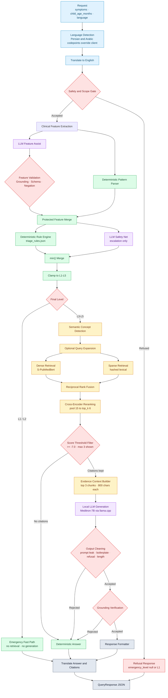

# Architecture

MediMama separates **deterministic clinical logic** from **probabilistic language-model output**, then constrains how the two are allowed to interact.

The entire design follows one invariant:

```text
final_level <= deterministic_level
1 <= final_level <= 5
```

Because `L1` is the most urgent level and `L5` the least, this guarantees a probabilistic component can raise urgency but never reduce it.

---

## Full Pipeline



| Color | Layer |
| :--- | :--- |
| 🔵 Blue | Input, language detection, normalization |
| 🟢 Green | Deterministic and reproducible logic |
| 🟣 Purple | Probabilistic LLM components |
| 🟡 Amber | Retrieval and ranking |
| 🔴 Red | Safety decisions and validation gates |
| ⚪ Slate | Output and formatting |

---

## Request Lifecycle

### 1. Language detection

The requested language is not trusted blindly. If the symptom text contains Persian or Arabic codepoints, the detected language overrides the client-supplied value. A user typing Persian into a form left on English still receives a Persian response.

### 2. Translation to English

All internal clinical logic — pattern matching, rules, retrieval, and grounding — operates in English. Translation failures fall back to the original text rather than aborting the request.

### 3. Safety and scope gate

Before any triage, the request is screened. Three refusal categories exist, and none of them receives a low-urgency level:

| Refusal type | `emergency_level` | Rationale |
| :--- | :---: | :--- |
| `safety_critical` | `1` | Immediate danger identified; escalate |
| `medication_misuse` | `null` | Ingestion not established; do not imply a clinical level |
| `scope` | `null` | Never clinically triaged |

If the safety checker itself raises, the request is refused conservatively as `safety_critical`. A broken gate must not become an open gate.

### 4. Clinical feature extraction

Two extractors run against the same input:

- **Deterministic parser** — regex and phrase patterns from `deterministic_feature_patterns.json`
- **LLM feature assist** — captures phrasings the patterns miss

LLM-proposed features must survive validation before merging:

| Check | Rejects |
| :--- | :--- |
| Grounding | Features not supported by the input text |
| Schema | Unknown fields and malformed JSON |
| Negation | Explicit negatives converted into positive findings |

Negation protection is the most important of the three. Without it, `"no breathing difficulty"` can be extracted as a respiratory-distress red flag, which inverts the clinical meaning of the sentence.

### 5. Rule engine and safety net

The merged feature set feeds two consumers, executed concurrently by `llm_orchestrator.py`:

- The **deterministic rule engine** produces the authoritative level from `triage_rules.json`
- The **LLM safety net** independently proposes a level

The safety net exists to catch presentations the rules do not encode yet. It is not permitted to relax them.

### 6. Escalation-only merge

```python
final_level = min(deterministic_level, llm_level)
final_level = max(1, min(5, final_level))
```

The `min()` enforces escalation-only behavior. The clamp guarantees the API can never return a level outside `1–5`, even if a rule file or model response contains a bad value.

If the rule engine raises an unhandled error, the fallback is **`L3` (same-day review)**, not `L5`. A defensive default that reduces urgency is not a defensive default.

### 7. Emergency fast path

`L1` and `L2` skip retrieval and generation entirely and return a deterministic response.

This is a safety decision before it is a performance decision:

- **Predictability** — the highest-risk guidance is fully reviewable, with no generative uncertainty
- **Latency** — the most time-critical cases never wait on a multi-second local model call
- **Availability** — emergencies are answered correctly even if Qdrant and the local model are both down

Emergency responses include a plain-language *why this matters* explanation, taken from the safety net's own reasoning where available, or from a curated mapping keyed on the triage reason (button battery ingestion, non-blanching rash, testicular torsion, and similar).

### 8. Retrieval — `L3` to `L5` only

```text
symptoms
  → semantic concept hints
  → optional query expansion
  → dense retrieval        (25 candidates)
  → sparse retrieval       (25 candidates)
  → reciprocal rank fusion
  → cross-encoder rerank   (pool 15 → top_k 6)
  → score threshold filter (>= -7.0)
  → max 3 citations shown
```

Sparse vector construction lives in a single module, `backend/rag/sparse_utils.py`, shared by the ingester and the retriever. A hashing mismatch between index time and query time destroys keyword recall silently — no exception, no failing test, just quietly worse results. Keeping both paths in one function makes that failure mode structurally impossible.

The rerank pool must stay larger than `top_k`. The cross-encoder can only correct dense and sparse ranking errors if it receives more candidates than are ultimately kept.

### 9. Grounded generation

Retrieved evidence is assembled into a numbered context block — the top 3 chunks, capped at 800 characters each — and passed to Meditron-7B through an Alpaca-style instruction template.

Raw output then passes several rejection gates:

| Gate | Rejects |
| :--- | :--- |
| Prompt-leak detection | Output echoing two or more system-prompt fragments |
| Boilerplate truncation | Research-paper text such as `# Discussion` or `The results showed` |
| Deduplication | Repeated sentences produced by the local model |
| Length check | Fewer than five meaningful words |
| Explicit-refusal detection | `"cannot answer"`, `"not enough information"` |
| Grounding verification | Claims unsupported by the retrieved evidence |

Any rejection returns a deterministic answer — never a partial, cleaned-up, or unverified one. **Citations are still shown** in that case, because the evidence was retrieved successfully; only the generated prose was discarded.

### 10. Response assembly

The answer, label, urgency text, and citations are translated into the detected language. Citations are deep-copied before translation so retrieval originals are never mutated, and the **untranslated** text is what reaches the audit log.

---

## Triage Levels

| Level | Name | Meaning |
| :---: | :--- | :--- |
| **L1** | Resuscitation | Life-threatening; immediate emergency response |
| **L2** | Emergency | Emergency department now |
| **L3** | Urgent | Same-day medical review |
| **L4** | Semi-urgent | GP or clinic within 1–2 days |
| **L5** | Non-urgent | Home care and routine monitoring |

---

## Safety Design

| Mechanism | Behavior |
| :--- | :--- |
| Deterministic triage | Core urgency established through testable rules |
| Escalation-only merge | The LLM may raise urgency but cannot lower it |
| Negation protection | Explicit negative findings cannot become positive red flags |
| Emergency fast path | `L1`/`L2` bypass retrieval and generation |
| Feature validation | LLM features must be supported by the input text |
| Output cleaning | Prompt leaks, boilerplate, and refusals discarded |
| Grounding verification | Unsupported answers trigger a deterministic fallback |
| Output clamping | Final level validated to `1–5` before it is returned |
| Conservative error floor | Rule-engine errors fall back to `L3`, not `L5` |
| Refusal isolation | Refused requests never silently receive `L5` |
| Non-crashing pipeline | Dependency failures degrade the answer, not the request |

### Fail-Safe Behavior

Every dependency is wrapped so a failure degrades the answer rather than failing the request:

| Failure | Behavior |
| :--- | :--- |
| Qdrant unavailable | No citations; deterministic answer |
| Local LLM not loaded | Deterministic answer, citations still shown |
| Generation error or empty output | Deterministic answer with citations |
| Grounding verification failure | Deterministic answer with citations |
| Safety-net timeout (`12s`) | Deterministic level used unchanged |
| Malformed safety-net JSON | Response discarded; deterministic level stands |
| Translation failure | Falls back to untranslated source text |
| Audit-logging failure | Written to stderr; response still returned |
| Safety-checker failure | Conservative `safety_critical` refusal |

Audit logging is isolated deliberately. A logging bug must never convert a valid medical answer into an HTTP 500.

### What This Design Does *Not* Do

Being explicit about the boundaries matters as much as the guarantees:

- It does not verify that the retrieved evidence is *clinically appropriate* for the case — only that the generated answer is grounded in whatever was retrieved
- It does not detect a plausible but wrong rule firing on an unusual presentation
- It does not prevent over-triage, which is accepted as the safer failure direction
- It has not been validated against real clinical outcomes

---

## Concurrency Model

`llama.cpp` is not thread-safe, so local generation is serialized behind a single lock:

```python
_llm_lock = threading.Lock()

with _llm_lock:
    llm_response = _llm(prompt, ...)
```

Consequences:

- Concurrent `L3–L5` requests **queue** on the local model
- `L1`/`L2` requests are **unaffected**, because the fast path never touches it
- The safety-net LLM is a network call and runs concurrently without contention

Retrieval models are pinned to CPU (`RETRIEVAL_DEVICE`, `RERANKER_DEVICE`) so their CUDA context does not collide with `llama.cpp`, which owns the GPU.

Horizontal scaling would require either one model instance per worker process or moving generation behind a dedicated inference server. This is a known limitation rather than a solved problem.

---

## Module Map

```text
backend/
├── main.py                          FastAPI app · /ask · /health · /health/ready
├── config.py                        Environment-driven settings
├── models.py                        QueryRequest and QueryResponse schemas
├── safety_checker.py                Safety and scope gate
├── semantic_concepts.py             Concept detection and retrieval hints
├── query_expansion.py               Optional semantic expansion
├── verification.py                  Grounding verification
├── response_formatter.py            Caregiver-facing formatting
├── translation.py                   Multilingual translation
├── audit_logger.py                  JSONL audit trail
│
├── triage/
│   ├── engine.py                    Escalation-only merge and clamp
│   ├── rule_engine.py               Deterministic evaluation
│   ├── triage_rules.json            Declarative rule definitions
│   ├── extract_clinical_features.py Pattern-based extraction
│   ├── deterministic_feature_patterns.json
│   ├── llm_feature_assist.py        LLM-assisted extraction
│   ├── feature_assist_merge.py      Grounding and negation protection
│   ├── llm_safety_net.py            Escalation-only safety net
│   └── llm_orchestrator.py          Concurrent LLM execution
│
└── rag/
    ├── ingestor.py                  Corpus loading, chunking, upsert
    ├── vector_store.py              Qdrant client and collections
    ├── sparse_utils.py              Shared sparse-vector construction
    ├── retriever.py                 Dense + sparse search and RRF
    └── reranker.py                  Cross-encoder reranking
```

Triage rules live in JSON rather than Python so clinical logic can be reviewed, diffed, and eventually validated by someone who does not read Python.